# 🤖 Conversational PDF QA Agent

A Streamlit-powered web application that lets you upload any PDF document and interactively ask questions about its content. Turn dense documents into dynamic conversations.

### 🚀 [**Live Demo**](https://pdf-ai-agent.streamlit.app/)

*(Note: The live demo is on a free service and may take 15-20 seconds to wake up on the first visit.)*


## ✨ Features

* **📄 Upload & Chat**: Simply drag-and-drop any PDF and start asking questions in natural language.

* **🧠 Context-Aware Retrieval**: Uses FAISS vector search to instantly find the most relevant information to answer your questions.

* **💬 Conversational Memory**: Remembers your chat history for seamless follow-up questions and context-aware conversations.

* **🔍 Inspectable Context**: A "Show Retrieved Contexts" toggle lets you see exactly which parts of the document the AI used to form its answer.

* **⚡ Blazing Fast & Efficient**: Caches indexes and embeddings for each PDF, making subsequent conversations instantaneous.

* **🔧 Extensible by Design**: Built with a minimal codebase that makes it easy to swap out embedding models, LLMs, or vector backends.

## 🏗️ System Architecture

This project is built using a **Retrieval-Augmented Generation (RAG)** architecture to ensure that answers are grounded in the content of the provided document.

```mermaid
flowchart LR
    classDef userAction fill:#e3f2fd,stroke:#1976d2,stroke-width:2px,color:#1976d2,font-weight:bold
    classDef systemProcess fill:#e8f5e9,stroke:#388e3c,stroke-width:2px,color:#388e3c
    classDef dataStore fill:#fff3e0,stroke:#f57c00,stroke-width:2px,color:#f57c00,shape:cylinder
    classDef llm fill:#f3e5f5,stroke:#8e24aa,stroke-width:2px,color:#8e24aa
    classDef prompt fill:#ede7f6,stroke:#5e35b1,stroke-width:2px,color:#5e35b1,shape:parallelogram
    classDef phaseTitle fill:none,stroke:none,color:#FFF,font-weight:bold,font-size:20px

    subgraph Phase 1
        direction TB
        Title1["Ingestion & Vectorization"]:::phaseTitle
        A["fa:fa-file-upload You upload PDF via Streamlit UI"]:::userAction
        B["fa:fa-cogs Text extracted via PyPDFLoader"]:::systemProcess
        C["fa:fa-cut Text chunked via RecursiveCharacterTextSplitter"]:::systemProcess
        D["fa:fa-brain Chunks embedded via SentenceTransformer"]:::systemProcess
        E["fa:fa-database Embeddings saved to FAISS"]:::dataStore
        Title1 ~~~ A --> B --> C --> D --> E
    end

    subgraph Phase 2
        direction TB
        Title2["Retrieval & Augmentation"]:::phaseTitle
        F["fa:fa-question-circle You ask a question in UI"]:::userAction
        G["fa:fa-brain Question embedded via SentenceTransformer"]:::systemProcess
        H["fa:fa-search FAISS search for top-K chunks"]:::systemProcess
        I["fa:fa-file-alt LLM prompt built by LangChain"]:::prompt
        Title2 ~~~ F --> G --> H --> I
    end

    subgraph Phase 3
        direction TB
        Title3["Response Generation"]:::phaseTitle
        J["fa:fa-robot API call to ChatGroq LLM (llama3‑8b)"]:::llm
        K["fa:fa-lightbulb-on Answer content received from LLM"]:::llm
        L["fa:fa-desktop Answer rendered in Streamlit UI"]:::userAction
        Title3 ~~~ J --> K --> L
    end

    E -- "Vector Store Ready" --> F
    I -- "Augmented Prompt" --> J

```



## 🛠️ Tech Stack

* **Framework**: Streamlit

* **AI Orchestration**: LangChain

* **LLM**: Llama 3 (via ChatGroq API)

* **Embedding Model**: `all-MiniLM-L6-v2` (via SentenceTransformers)

* **Vector Store**: FAISS (Facebook AI Similarity Search)

* **PDF Processing**: PyPDFLoader

## 📦 Installation & Setup

Get your own local copy up and running in a few simple steps.

1. **Clone the repository**

   ```bash
   git clone [https://github.com/dubeyrudra-1808/PDF_AGENT.git](https://github.com/dubeyrudra-1808/PDF_AGENT.git)
   cd PDF_AGENT
   ```

2. **Create and activate a virtual environment**

   ```bash
   # For macOS/Linux
   python3 -m venv .venv
   source .venv/bin/activate
   
   # For Windows
   python -m venv .venv
   .\.venv\Scripts\activate
   ```

3. **Install dependencies**

   ```bash
   pip install -r requirements.txt
   ```

4. **Set up environment variables**

   * Create a file named `.env` in the root of the project.

   * Add your Groq API key to this file:

     ```ini
     [GROQ]
     API_KEY="gsk_your_groq_api_key_here"
     ```

## 🎯 Usage

1. **Run the Streamlit app**

   ```bash
   streamlit run streamlit_app.py
   ```

2. **Open in your browser**

   * Navigate to `http://localhost:8501`.

3. **Start Chatting!**

   * Drag and drop your PDF into the uploader.

   * Wait for the initial processing to complete.

   * Ask questions in the chat interface and get instant, context-aware answers.

## 🤝 Contributing

Contributions are what make the open-source community such an amazing place to learn, inspire, and create. Any contributions you make are **greatly appreciated**.

1. Fork the Project

2. Create your Feature Branch (`git checkout -b feat/AmazingFeature`)

3. Commit your Changes (`git commit -m 'feat: Add some AmazingFeature'`)

4. Push to the Branch (`git push origin feat/AmazingFeature`)

5. Open a Pull Request

## 📝 License

Distributed under the MIT License. See `LICENSE` for more information.

*Developed with ❤️ by Rudra Dubey.*
